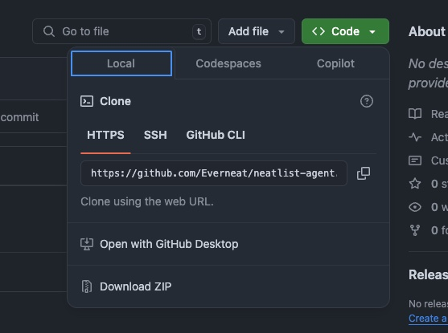

# SSH Configuration
## type the following command
`nano ~/.ssh/config`
## add the following configuration
```
Host github-default
HostName github.com
User git
IdentityFile ~/.ssh/id_rsa

Host yourhostname
HostName github.com
User git
IdentityFile ~/.ssh/id_rsa_project_name
```
- you may add more to this file every repository/project,
- placeholder are `yourhostname` and `id_rsa_project_name`
## generate ssh
`ssh-keygen -t rsa -b 4096 -C "your_email" -f ~/.ssh/id_rsa_project_name`
- press enter all the way
### Add Your Public Key to GitHub repository > settings > add deploy keys
`pbcopy < ~/.ssh/id_rsa_account1.pub`
## Go to project repository > Code > Local > SSH then copy URL

- the copied url looks something like this 
- Change `git@github.com:Everneat/neatlist-agent.git` to `git@yourhostname:Everneat/neatlist-agent.git`
## Final clone syntax is 
`git clone git@yourhostname:Everneat/neatlist-agent.git`